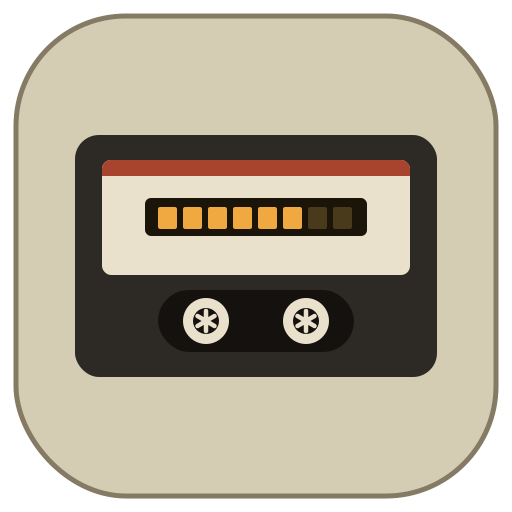
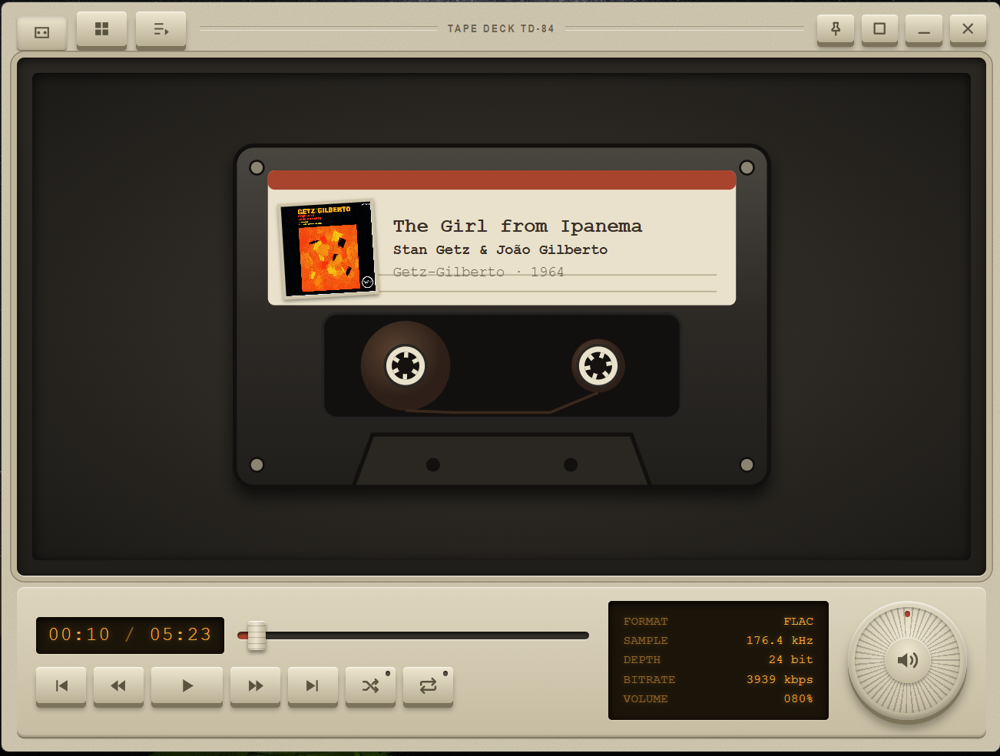
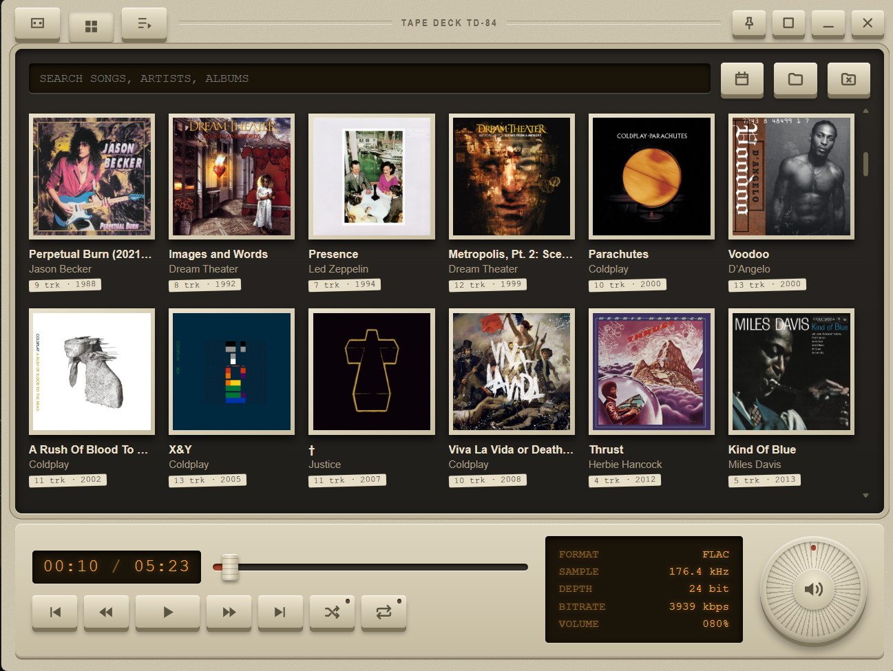
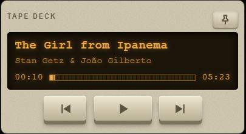

<div align="center">



# Tape Deck

**An 80s-style cassette music player for your local music library.**

Made by [Kashyap Krishna Jayanth](https://github.com/KashyapKrishnaJ)

Skeuomorphic hardware keys, an amber LCD, a spinning cassette, and a volume wheel you can actually turn.


</div>

---






## What is it?

Tape Deck plays the music already on your computer, with no accounts, streaming or ads. Point it at a folder and it builds a browsable library from your files' tags and embedded cover art. Everything is styled like a piece of vintage hardware: cream plastic keys that physically press down, an amber LCD readout, and a cassette whose reels turn while the music plays.

## Features

### The player
- **Animated cassette.** The reels spin while playing, and the tape moves from the supply reel to the take-up reel as the track progresses.
- **Cassette label.** Shows the current album art, title, artist and album. Any line too long for the label scrolls as a marquee.
- **Hardware transport keys.** Play/pause, previous, next, rewind 10 s and forward 10 s. *Previous* restarts the track if you're more than 3 seconds in.
- **Shuffle and repeat.** Repeat cycles through off, repeat all and repeat one, and the key LEDs light up when active.
- **Scrub fader.** Drag it to seek, with a tape-scrub sound as you move.
- **Volume wheel.** Drag it around, use the mouse wheel, or click it to mute. It has inertia-free detent clicks as it turns.
- **LCD info panel.** Shows format, sample rate, bit depth, bitrate and volume for the current track.
- **Key sounds.** Every button has a small mechanical click. They respect your system's reduced-motion setting where motion is involved.

### Library
- **Recursive folder scan.** Reads `mp3`, `m4a`, `flac`, `wav`, `ogg`, `aac` and `opus`.
- **Album grid.** Cover art, track count and year, sortable by **artist**, **album** or **year**.
- **Search.** Find songs, artists and albums, with matching songs listed below the albums.
- **Album pages.** Play the whole album, add it to the queue, or add single tracks. Multi-disc albums can be split by disc.
- **Embedded artwork.** Cover art is extracted from your files and cached. Tracks without art get a generated colored placeholder.

### Queue
- **Drag and drop** to reorder, with an LCD-style insertion marker.
- Remove single tracks or clear everything. The header shows track count, total runtime and the current position.

### Pin to top (mini player)
A compact, always-on-top, fixed-size window for keeping music controls handy while you work:
- LCD ticker for track title and artist, scrolling when text doesn't fit
- Segmented progress bar you can click to seek
- Previous, play/pause and next keys

### It remembers
Your queue, current track and position, volume, mute, shuffle, repeat, sort order and music folder are all restored the next time you open the app. See [Where your data lives](#where-your-data-lives).

## Download

Ready-made installers are on the [**Releases**](../../releases) page. Download the latest one and run it. There's nothing to build or set up yourself.

| Platform | File |
|---|---|
| Windows (x64, x86, ARM64) | `Tape Deck Setup x.y.z.exe`, or the portable `.exe` for no-install use |
| macOS | `.dmg` |
| Linux | `.AppImage` or `.deb` |

> **A note on Windows warnings.** The app isn't code-signed yet, so Windows SmartScreen may show "Windows protected your PC" the first time you run it. Click **More info → Run anyway**. On macOS, right-click the app and choose **Open** the first time.

Requires Windows 10 or later (a limit of the Electron version used).

## Run from source (for developers)

Most people should just use the [installer from Releases](../../releases). If you want to run or modify the code, you need [Node.js](https://nodejs.org/) 18 or newer.

```bash
git clone https://github.com/<your-username>/tape-deck.git
cd tape-deck
npm install
npm start
```

Then click the folder button and choose your music folder.

## Where your data lives

Tape Deck stores its settings and cache in Electron's per-user data folder, outside the app, so they survive updates and reinstalls:

| OS | Location |
|---|---|
| Windows | `%APPDATA%\tape-deck` |
| macOS | `~/Library/Application Support/tape-deck` |
| Linux | `~/.config/tape-deck` |

- `state.json` holds your queue, position, volume and preferences.
- `covers/` holds extracted album art.

Your music files are never modified or copied. The library is rescanned on every launch, so changes to your folder always show up. To reset the app completely, close it and delete that folder.

## Project structure

```
tape-deck/
├── main.js        Electron main process: window, folder scan, metadata, saved state
├── preload.js     Safe bridge between the UI and the main process
├── index.html     The entire interface: markup, styles and logic (no framework)
├── package.json   Dependencies and electron-builder config
├── make_icons.py  Generates the logo and icon files
└── build/         Logo and app icons used when packaging
```

## Built with

- [Electron](https://www.electronjs.org/) for the desktop shell
- [music-metadata](https://github.com/Borewit/music-metadata) for reading tags, durations and cover art
- Plain HTML, CSS and JavaScript, with an inline SVG cassette and the Web Audio API for the key and scrub sounds

## Contributing

Bug reports and ideas are welcome. Open an [issue](../../issues) describing what you saw and what you expected, including your OS and the audio format involved if it's playback-related. Pull requests are welcome too; for anything bigger than a small fix, please open an issue first so we can talk it through.

## License

Released under the [MIT License](LICENSE).